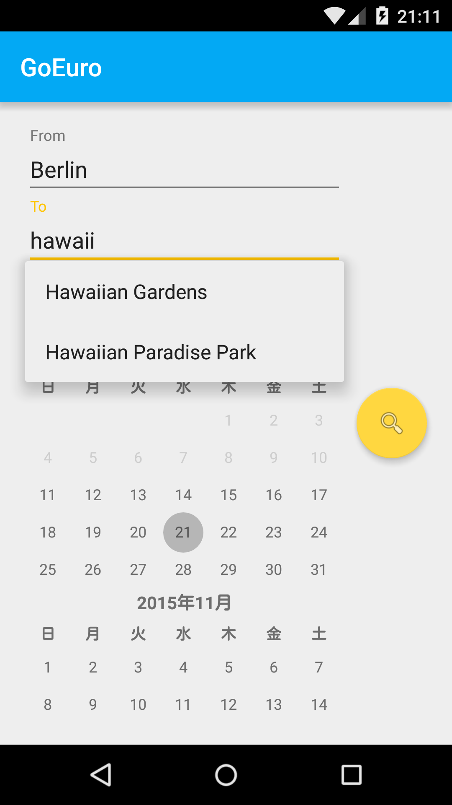

# GoEuro Mobile Developer - Test Entry

This is my entry to the "Mobile Developer Test" from GoEuro. See [the original repository](https://github.com/goeuro/mobile-test) for details on the subject.

## Specifications

The application is only one screen, which lets the user select a departure location, an arrival location and a date of travel.
When (and only when) all fields contain valid input (i.e. some text for the locations and a date later than or equal to the current date), a search button is visible. By clicking the search button or triggering search through the IME, the user can initiate a search with the current input values as parameter. For now, this only shows a message (containing the search parameters) to the user.

During location input, if a network connection is available, autocompletion options are shown in a dropview and updated as the user types. If the Google location service is enabled and a user location is available, autocompletion options are ordered by increasing distance from the last known user location.

## Implementation

Code is written in [Kotlin](https://kotlinlang.org/) (M14), and events are processed through reactive streams ([RxJava](https://github.com/ReactiveX/RxJava) / [RxKotlin](https://github.com/ReactiveX/RxKotlin) and [RxBinding](https://github.com/JakeWharton/RxBinding) for UI event streams). [Dagger2](https://google.github.io/dagger/) is used for injecting a few dependencies. Communication with the REST API is handled with [retrofit](https://square.github.io/retrofit/) and responses are parsed with [Jackson](https://github.com/FasterXML/jackson) (and [its Kotlin module](https://github.com/FasterXML/jackson-module-kotlin)).

The implementation specific to acquiring user location is kept in a dedicated activity for better separation of concerns and allow future reusability.

## Limitations

- although network and location unavailability are handled, the user isn't currently notified of such through the UI
- a few bugs in the `CalendarView` are currently not addressed:
 - on some platforms (verified on 4.4.4) the calendar starts with an initial scroll at the year 2100 (although the current date is properly selected) ; this seemingly only occurs when the calendar view minimum date is set to a date too close to the current one (which is the case in the current implementation)
 - on some platforms (verified on 5.1), the calendar view `date` property doesn't hold the selected date, which means that when the view is destroyed / recreated it gets recreated at the current date instead of the last selected ones
- location is currently only acquired through the Google Play location service
- no test :(

## Screenshot

